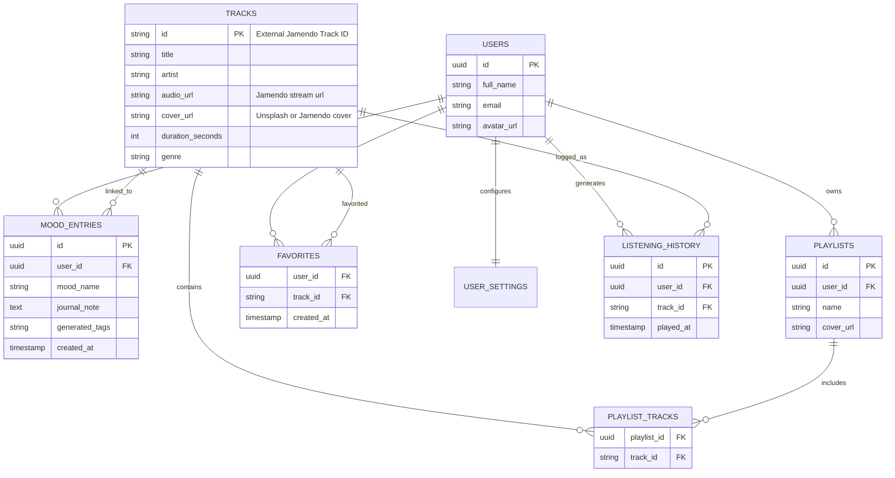

# Moodify - Supabase Backend & API Integration PRD

## 1. Overview
The objective of this phase is to transition the **Moodify** frontend prototype into a fully functional, data-driven application using **Supabase** as the Backend-as-a-Service (BaaS) alongside **Free Third-Party APIs** for music streaming and AI mood curation. The architecture leverages a **Model Context Protocol (MCP) Server** to proxy logic. 

This document maps user actions to backend operations, outlines the PostgreSQL schemas, establishes authentication flows, and defines external API connections.

---

## 2. External API Integrations (Free Tier)
To create a fully robust music application without incurring massive costs, Moodify will rely on the following external services:

### 2.1 Music Fetching & Streaming API
* **Jamendo API (**`api.jamendo.com`**)**
  * **Purpose:** Provides a massive catalog of independent, royalty-free music. 
  * **Why:** Unlike Spotify or Apple Music, Jamendo provides **direct `.mp3` streaming URLs** for free non-commercial usage.
  * **Endpoints Used:** `/v3.0/tracks/?tags={genre}` (Fetch tracks), `/v3.0/tracks/file/` (Stream audio).

### 2.2 LLM / AI Mood Curation API
* **Google Gemini API (**`ai.google.dev`**) or Groq API (Llama 3)**
  * **Purpose:** Reads user journal entries or exact mood states and translates them into musical features (BPM, specific genres, acousticness) to search against Jamendo.
  * **Why:** Extremely generous free tier.
  * **Flow:** `Journal Text -> Gemini LLM -> Output JSON {"genres": ["lofi", "ambient"], "tags": ["calm", "rain"]} -> Jamendo Search`.

### 2.3 Supporting APIs
* **Unsplash Source API**
  * **Purpose:** Fetching high-quality, mood-matching cover art for dynamically AI-generated playlists.
  * **Why:** Free and doesn't require complex authentication for simple keyword queries. (e.g., `https://source.unsplash.com/random/?rain,aesthetic`).

---

## 3. Supabase Database Design (Schema)

To support mood tracking, user analytics, and caching external music data, the following relational data schema is required.

---

## 4. UI Button to Backend Mapping

Every actionable button and screen transition requires a specific API block. 

### 4.1 Authentication (Login / Register Screens)
| Button / Action | Primary API Method |
| :--- | :--- |
| **"Sign in with Google/Apple"** | `supabase.auth.signInWithOAuth()` |
| **"Log In" (Email/Pass)** | `supabase.auth.signInWithPassword()` |
| **"Sign Up"** | `supabase.auth.signUp()` |

### 4.2 Mood Selection & Journaling
| Button / Action | Primary API Method | Description |
| :--- | :--- | :--- |
| **"Continue" (Mood Screen)** | `Gemini API + Jamendo` | Connects mood string to Gemini to generate acoustic tags, then queries Jamendo for tracks. Caches tracks in Supabase `TRACKS` table. |
| **"Save Entry" (Journal)** | `supabase.from('mood_entries').insert()` | Saves the journal note securely. |

### 4.3 Music Player & Playlists
| Button / Action | Primary API Method | Description |
| :--- | :--- | :--- |
| **"Play" Track** | `just_audio` (Flutter) + Supabase | Streams the `audio_url` via Jamendo. Logs a stream event to `listening_history` in Supabase. |
| **Favorite/Heart Icon** | `supabase.from('favorites').insert()` | Toggles the track id in the user's favorite tracking row. |
| **Add to Playlist** | `supabase.from('playlist_tracks').insert()`| Links a Jamendo track to a specific custom user playlist. |

### 4.4 Profile & Settings
| Button / Action | Primary API Method | Description |
| :--- | :--- | :--- |
| **Upload Avatar** | `supabase.storage.from('avatars').upload()` | Uploads cropped avatar, fetches public URL, and updates `users` record. |

---

## 5. MCP (Model Context Protocol) Server Integration Flow

Instead of Flutter handling API keys and heavy logic, an **MCP Server (Node.js/Python)** acts as the centralized brain.

### 5.1 Architecture Flow for AI Playlist Generation
1. **App Action:** User writes a journal entry: *"It's raining and I feel deeply nostalgic."*
2. **Flutter MCP Call:** App triggers tool `curate_mood_playlist({ "journal_text": "...", "user_id": "123" })`.
3. **MCP Logic Step 1 (LLM Phase):** MCP Server sends text to **Gemini API**. Gemini responds: `{ "mood": "Nostalgic", "genres": ["lofi", "ambient"], "tempo": "slow" }`.
4. **MCP Logic Step 2 (Music Fetch):** Server makes a REST call to **Jamendo API** searching for `tags=lofi,ambient`.
5. **MCP Logic Step 3 (Database Sync):** Retrieved tracks are Upserted into Supabase `TRACKS` table.
6. **Final Format Return:** App receives JSON payload of fully structured, playable Tracks.

### 5.2 Exposed MCP Tools to Implement
* `gemini_analyze_mood(text)`: Wrapper for Google AI text analysis.
* `jamendo_fetch_tracks(tags, tempo)`: Wrapper for Jamendo `/tracks` endpoint.
* `get_supabase_analytics(user_id)`: Fetches data for the dashboard via Supabase API RPCs.
